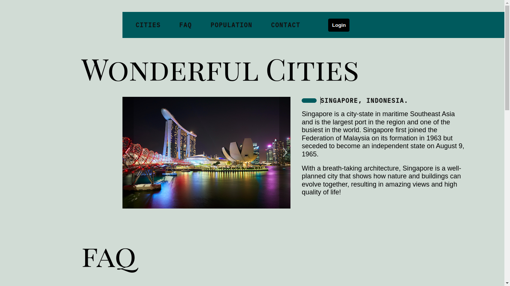

<h1 align="center">🌆 Wonderful Cities 🏖️</h1>

This project is made for travel enthusiasts or just interested in country trivia/histories. I'm developing and adding new features using ReactJS, and following the TDD methodology, through the React Testing Library and Cypress.

<h1>Techs & tools used:</h1>

- Cypress: UI e2e tests
- React Testing Library
- React Hooks
- React Context API
- Stylized with CSS

<h1>A glimpse</h1>

- Available at <a href="https://guihtryb.github.io/wonderful-cities/">this link</a>
